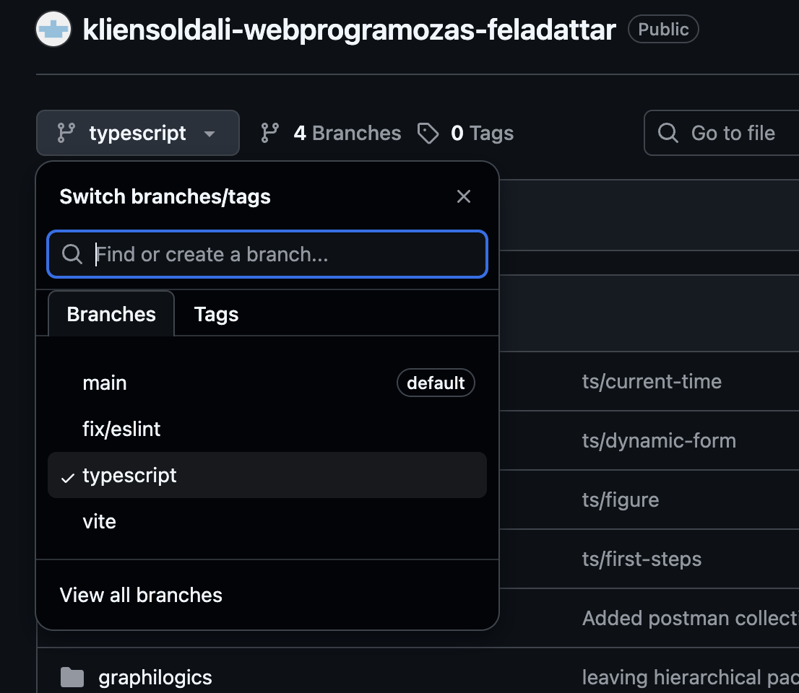

A 6. gyakorattól a kliensoldali webprogramozás feladattárából dolgozunk.

Töltsd le innen: 
- https://github.com/horvathgyozo/kliensoldali-webprogramozas-feladattar
FONTOS: A TypeScript branch állapotát töltsd le, ne a main branch-ét!

A 6. gyakorlaton a `myplaylist-sitebuild-components` projekten dolgoztunk.